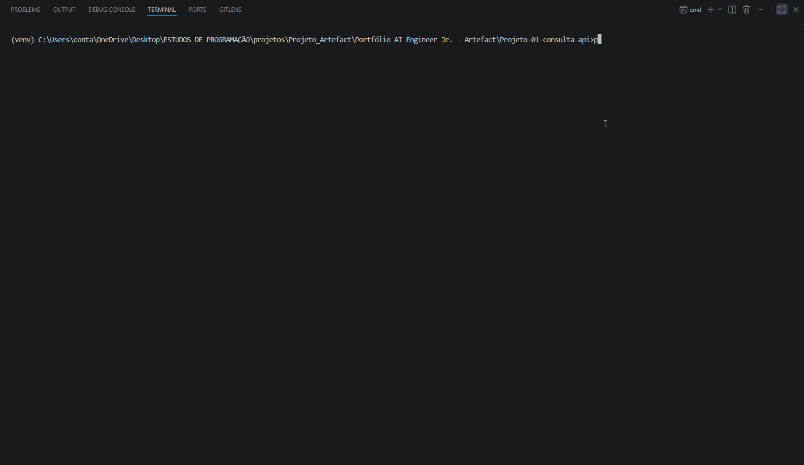

# 🔎 Consulta de CEP via API

Programa de linha de comando (CLI) em Python que recebe um CEP, consulta a API pública [ViaCEP](https://viacep.com.br/) e retorna o endereço completo formatado. O foco do projeto é **consumo de APIs REST** com tratamento de erros e código organizado.

## 📺 Demonstração



```
=== Consulta de CEP ===
Digite "sair" para encerrar.

Digite o CEP: 24731-190

--- Endereço encontrado ---
Rua:    Rua Planalto
Bairro: Miriambi
Cidade: São Gonçalo - RJ
```

## ✨ O que faz

- Recebe um CEP digitado pelo usuário (aceita com ou sem traço/espaços)
- Consulta a API ViaCEP e exibe rua, bairro, cidade e estado
- **Valida o formato** antes de chamar a API (8 dígitos numéricos)
- **Trata erros** de conexão, timeout e CEP inexistente sem quebrar
- Permite **consultar vários CEPs em sequência** até o usuário digitar `sair`

## 🛠️ Tecnologias

- **Python 3**
- **[requests](https://pypi.org/project/requests/)** — chamadas HTTP à API
- **API ViaCEP** — fonte dos dados de endereço (gratuita, sem chave)

## ▶️ Como rodar

```bash
# 1. Clone o repositório
git clone https://github.com/Joaomarcelloo-dev/projeto-01-consulta-api.git
cd projeto-01-consulta-api

# 2. Crie e ative o ambiente virtual
python -m venv venv
venv\Scripts\activate        # Windows
# source venv/bin/activate   # Linux/Mac

# 3. Instale as dependências
pip install -r requirements.txt

# 4. Execute
python main.py
```

## 💡 Exemplo de uso

```
=== Consulta de CEP ===
Digite "sair" para encerrar.

Digite o CEP: 24731-190

--- Endereço encontrado ---
Rua:    Rua Planalto
Bairro: Miriambi
Cidade: São Gonçalo - RJ
```

## 🧠 O que aprendi

- Consumir uma **API REST** com `requests` e interpretar a resposta em JSON
- Tratar erros com `try/except` e `timeout` para o programa não travar nem quebrar
- Organizar o código em **funções com responsabilidade única** (validar, consultar, exibir) em vez de um script corrido
- Usar `while`, `break` e `continue` para criar um fluxo de uso contínuo

---

Projeto 1 de uma série de estudos em IA aplicada. Desenvolvido por *João Marcello*.
